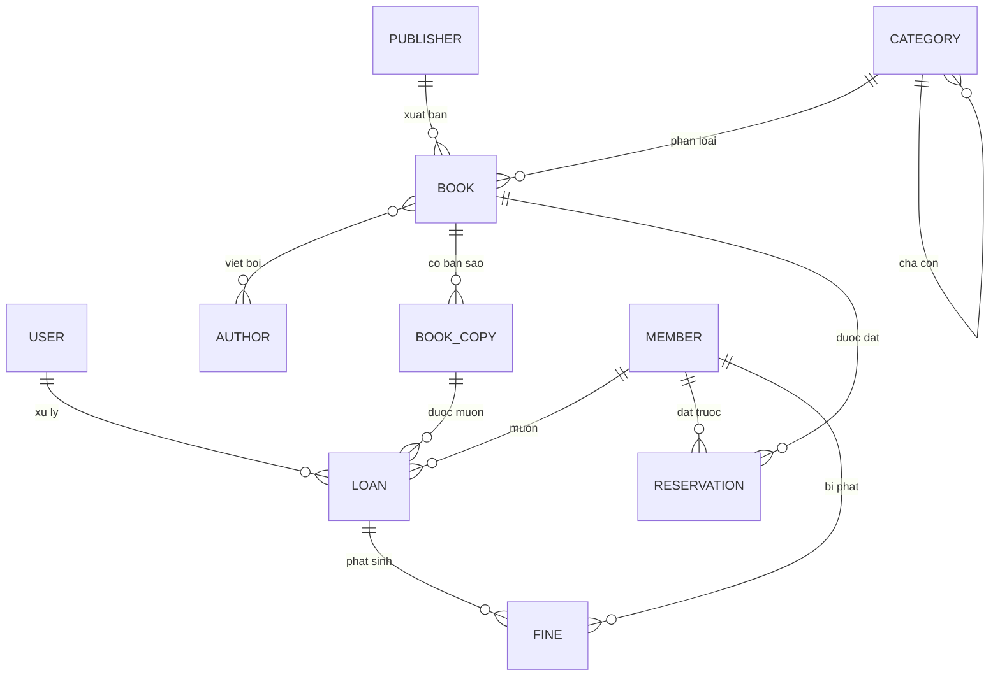

# Hệ thống Quản lý Thư viện

Ứng dụng web full-stack quản lý thư viện: quản lý sách và bản sao, độc giả, mượn, trả, gia hạn, đặt trước, phạt và báo cáo. Backend Spring Boot, cơ sở dữ liệu PostgreSQL, frontend Next.js, xác thực bằng Clerk.

Nhân viên (thủ thư) đăng nhập bằng Clerk và sử dụng toàn bộ chức năng như nhau (không phân quyền, không admin). Độc giả là dữ liệu nghiệp vụ, không phải tài khoản đăng nhập.

## Kiến trúc

```
Trình duyệt (Next.js, cổng 3000)  ──Bearer JWT của Clerk──▶  Backend REST API (Spring Boot, cổng 8080)
                                                                      │
                                                                      ▼
                                                          PostgreSQL (Docker, cổng 5433)
```

- Backend theo kiến trúc phân lớp: `Controller → Service → Repository → Entity`. Controller mỏng, Service chứa nghiệp vụ và `@Transactional`, DTO tách biệt Entity, mapping bằng MapStruct.
- Xác thực: frontend đính kèm Clerk session JWT vào mọi request; backend là OAuth2 Resource Server, xác thực chữ ký qua JWKS của Clerk và kiểm tra issuer. Không có endpoint đăng nhập ở backend.
- Provision: lần đầu một nhân viên gọi API, backend tạo bản ghi `users` nội bộ từ token (lấy email/tên/ảnh qua Clerk Backend API) để gắn `created_by` cho phiếu mượn/trả và phạt.

### Sơ đồ quan hệ dữ liệu (ERD)



## Công nghệ

| Tầng | Công nghệ |
|---|---|
| Backend | Java 21, Spring Boot 4.1, Spring Web MVC, Spring Data JPA (Hibernate 7), Spring Security 7 (OAuth2 Resource Server), Flyway, MapStruct, springdoc-openapi, Actuator |
| Database | PostgreSQL 17 (Docker Compose), migration versioned bằng Flyway |
| Object storage | Cloudflare R2 (tương thích S3) cho ảnh bìa sách |
| Frontend | Next.js 16 (App Router), TypeScript, shadcn/ui trên Base UI, Tailwind CSS v4, TanStack Query, react-hook-form + zod, Recharts |
| Auth | Clerk (`@clerk/nextjs`) |
| Build | Maven Wrapper (backend), pnpm (frontend) |

## Yêu cầu môi trường

- JDK 21 (kiểm tra `java -version`).
- Docker Desktop (chạy PostgreSQL).
- pnpm và Node.js 20+ (frontend).
- Tài khoản Clerk (đã cấu hình sẵn khóa test trong `.env`).

## Cấu hình

Các file môi trường đã được commit sẵn trong repo private này (theo chủ đích, xem Mục 4 của spec): `.env` (cổng Docker), `backend/.env` (DB, Clerk, R2, CORS), `frontend/.env.local` (Clerk, API base URL). Mỗi file có bản `*.example` liệt kê tên biến.

Cấu hình Clerk: dùng khóa `NEXT_PUBLIC_CLERK_PUBLISHABLE_KEY` và `CLERK_SECRET_KEY`. Backend suy ra issuer và JWKS từ domain của khóa publishable (`CLERK_ISSUER_URI`, `CLERK_JWKS_URI`).

> Lưu ý an toàn: repo phải luôn ở chế độ private. Nếu chuyển sang public, phải rotate toàn bộ secret trước.

## Chạy hệ thống

Thứ tự: Database → Backend → Frontend.

### 1. PostgreSQL (Docker Compose)

```bash
docker compose up -d postgres
```

PostgreSQL chạy ở `localhost:5433` (đổi từ 5432 để tránh xung đột), database `library`. Compose cũng định nghĩa Redis (không bắt buộc cho ứng dụng).

### 2. Backend (Maven Wrapper)

```bash
cd backend
./mvnw spring-boot:run
```

Backend chạy ở `http://localhost:8080`. Flyway tự động tạo schema và seed dữ liệu master (cấu hình thư viện, chính sách mượn theo loại thẻ, đơn giá phạt, tập thể loại chuẩn).

- Health: `http://localhost:8080/actuator/health`
- Tài liệu API (Swagger, chỉ bật ở profile dev): `http://localhost:8080/swagger-ui.html`

### 3. Frontend (pnpm)

```bash
cd frontend
pnpm install
pnpm dev
```

Frontend chạy ở `http://localhost:3000`. Nếu cổng 3000 bận, Next.js dùng 3001/3002 (CORS backend đã cho phép các cổng này khi dev). Mở trình duyệt, đăng ký/đăng nhập bằng Clerk, sau đó dùng toàn bộ chức năng.

Bản production: `pnpm build && pnpm start`.

## Quy tắc nghiệp vụ mặc định (chỉnh được trong màn hình Cấu hình)

| Loại thẻ | Số sách tối đa | Thời hạn mượn | Số lần gia hạn |
|---|---|---|---|
| REGULAR | 3 | 14 ngày | 1 |
| STUDENT | 5 | 21 ngày | 2 |
| PREMIUM | 10 | 30 ngày | 3 |

- Phạt quá hạn: 5.000 đ/ngày/cuốn. Chặn mượn khi tổng phạt chưa thu vượt 50.000 đ.
- Phí mất sách mặc định 200.000 đ, hỏng 50.000 đ (có thể ghi đè khi trả).
- Giữ đặt trước sau khi sẵn sàng: 3 ngày.
- Tiền tệ: VND. Ngày giờ lưu UTC ở backend, hiển thị theo giờ Việt Nam ở frontend.

## An toàn đồng thời

- Bản sao sách dùng optimistic locking (`@Version`): hai giao dịch cho mượn cùng một bản sao không thể cùng thành công (giao dịch thua nhận HTTP 409).
- Số lượng `available_copies`/`total_copies` được tính lại trong khóa bi quan trên đầu sách để không bị mất cập nhật khi mượn/trả đồng thời nhiều bản sao khác nhau.
- Thu phạt idempotent: thu lại một khoản đã thu không tạo bản ghi trùng.

## Kiểm thử

```bash
cd backend
./mvnw test
```

Kiểm thử tích hợp dùng Testcontainers (PostgreSQL thật) và MockMvc với JWT giả. Test gắn thẻ `r2` (tải ảnh lên R2 thật) bị loại trừ mặc định; chạy bằng `./mvnw "-Dtest.excludedGroups=" "-Dgroups=r2" test`.

Frontend:

```bash
cd frontend
pnpm lint && pnpm typecheck && pnpm build
```

## Triển khai

- PostgreSQL qua Docker Compose (pin `postgres:17-alpine`, có healthcheck và volume bền vững).
- Backend đóng gói jar bằng `./mvnw clean package` rồi chạy `java -jar target/library-0.0.1-SNAPSHOT.jar` với `SPRING_PROFILES_ACTIVE=prod` (prod dùng `ddl-auto=validate`, tắt Swagger, log gọn, cấu hình từ biến môi trường).
- Frontend build bằng `pnpm build` và chạy `pnpm start` (hoặc triển khai lên nền tảng hỗ trợ Next.js).
